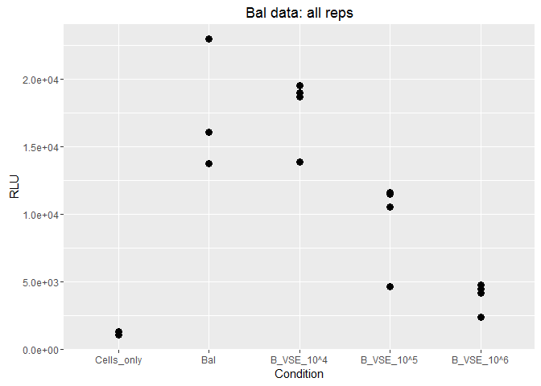
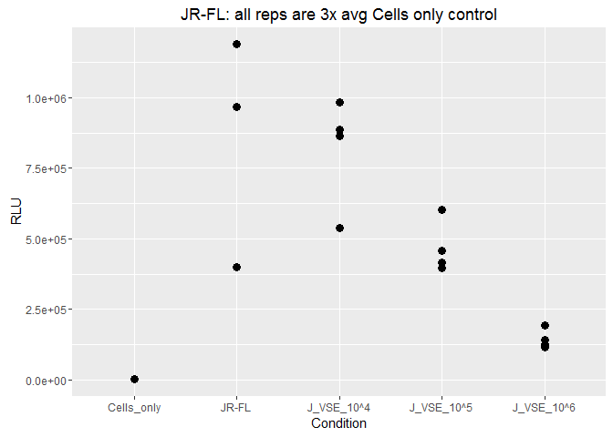
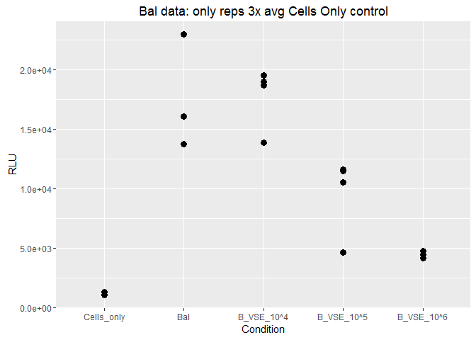
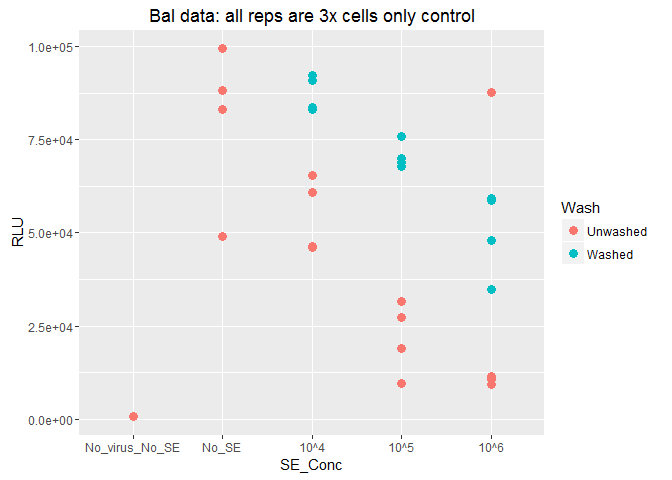
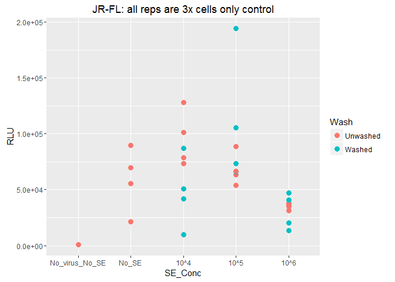
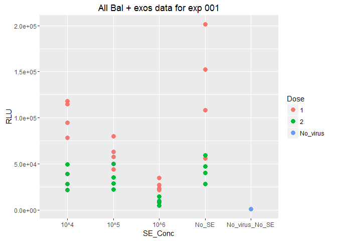
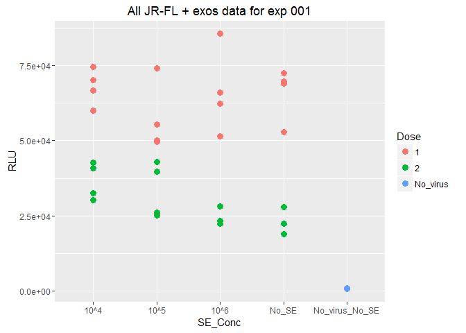

TZM-bl infection assay 003 experiment goal
------------------------------------------

Measure effect of pre-incubating virus and SE with different concentrations of virus per PFU

-   Used day8 purified virus for Bal and day5 JR-FL

Results
-------

There is a dose response effect of the SE for both Bal and JR-FL; the RLU is lower (less infection) as the concentration of SE per PFU increases. All replicates were at least 3x the cells only (no virus, no SE) control except for one replicate in the Bal treatment.

In general, the cells infected with Bal had higher RLU readouts.

  

TZM-bl infection assay 004 experiment goal
------------------------------------------

Measure effect of pre-incubating TZM-bl cells and SE before adding virus (either JR-FL or Bal) and compared when the SE are removed ("Washed") or left on the cells ("Unwashed")before adding the virus.

-   Used day8 purified virus for Bal and JR-FL (in exp 003 used d5 for JR-FL)

Results
-------

Except for JR-FL washed, there is a dose response effect of the SE for both Bal and JR-FL; the RLU is lower (less infection) as the concentration of SE per PFU increases. All replicates were at least 3x the cells only (no virus, no SE) control.

Bal: In general, the RLU is lower (less infection) for the cells that were washed.

JR-FL: The RLU is lower for the washed cells in the 10^4 and 10^6 exos per PFU conditions, but higher/the same for the 10^5 exos per PFU condition. Also note that the virus alone control is lower than expected.

 

TZM-bl infection assay 001 experiment goal
------------------------------------------

Measure effect of pre-incubating virus and SE with different concentrations of virus per PFU

-   Used day8 purified virus for Bal and day5JR-FL
-   Lucia did this experiment, I am just showing some of her results and used her plate layout for reference.

Lucia used different two different doses for each virus

-   Bal dose 1 = virus dilution of 1:6250
-   Bal dose 2 = virus dilution of 1:31250
-   JR-FL dose 1 = virus dilution of 1:1250
-   JR-FL dose 2 = virus dilution of 1:6250

Results
-------

I am just plotting the results of the SE + cells data, there were also some wells that were exposed to seminal plasma but we didn't repeat that in 003 or 004.

 
